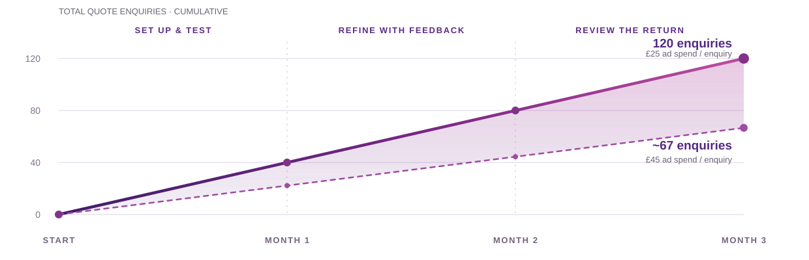

# Direct Couriers London × Digital Movement UK

## More enquiries and more jobs for Direct Couriers through Meta Ads.

We build focused Facebook and Instagram campaigns that make it easy for people to request a quote from you.

| Monthly retainer | Monthly ad budget | Total monthly investment | Three-month contract |
| --- | --- | --- | --- |
| £500 | £1,000 | £1,500 | £4,500 total |

## 01 — The opportunity

### We target audiences with a clear reason to reach out to you.

We recommend starting with home and flat removals, then testing other transport needs separately.

#### Home and flat removals

**Recommended campaign focus**

We lead the campaign with people planning a home move. What we need from you is the job sizes, the routes and the minimum price points that make this worthwhile for you.

#### Larger furniture and multi-item transport

**Next target audience test**

We test this separately and see if we can attract substantial transport jobs rather than low-value or single-item requests.

#### Business transport

**Third opportunity**

We can test office moves, pallets and other business transport separately, using the routes, job sizes and minimum prices you agree with us.

## 02 — Your reference points

### We use AnyVan and Pickfords as blueprints for the quote journey.

You mentioned AnyVan and Pickfords as blueprints. Looking at their websites, what we want to do is identify and connect a specific transport need with a price or quote request.

#### Show the job you offer

**Clear service**

We show the specific moving or transport job you offer, so people can recognise whether it fits their needs.

#### Make requesting a quote easy

**Simple quote request**

We give people a clear next step and a short form to tell you what needs moving, where and when.

#### Agree viable routes and jobs

**Viable jobs**

We agree routes, job sizes and minimum prices with you, Adrian, so the campaign focuses on work that is worthwhile for you.

[AnyVan](https://www.anyvan.com/) · [Pickfords](https://www.pickfords.co.uk/)

## 03 — Target audience

### Each ad campaign focuses on a specific target audience with pain points and needs.

We give each audience a relevant message and a quote form that helps you assess the job.

#### People planning home or flat moves

**First campaign**

Moving customers need a date, enough help and room for their load. We show removal support and ask about timing, load size and route.

#### People moving furniture or several items

**Separate test**

Their furniture will not fit in a car, or several items need moving. We show larger loads and ask what needs transporting.

#### Businesses arranging transport

**Later opportunity**

Businesses need stock, pallets or office equipment moved on time. We name the service and collect the load, route and timing.

We agree the initial routes and job criteria with you before launching.

## 04 — Campaign structure

### We propose a £1,000 ad budget and focused targeting.

We suggest an initial advertising budget of £1,000 per month to learn whether home-removal enquiries can become worthwhile bookings for you.

- We run adverts on Facebook and Instagram with a monthly ad budget of £1,000 — approximately £33 a day.
- We start with home and flat removals in the areas and on the routes you want to serve.
- We send interested people to a Meta quote form that collects the details you need to assess their move.
- We compare enquiry cost, job suitability and the bookings you report to us.
- We introduce a separate audience or service test when the first campaign gives us enough information to make that decision.

The £1,000 monthly ad budget sits alongside our £500 monthly retainer, making the total monthly investment £1,500.

## 05 — Ad concepts

### Our creatives show the transport jobs you offer and make quote requests easy.

We use clear images and copy to show the type of job you want, address the audience’s needs and invite them to request a quote.

#### Moving home? Get your transport quote.

**Launch concept 01 · Home removals**

Planning a house or flat move? Direct Couriers London provides removals across the UK. Tell us where you're moving from, where you're going and your preferred date to request a quote.

**CTA:** Get quote

**Suggested visual:** An approved photo or short clip of a van being loaded for a move.

#### New address. Now for the move.

**Launch concept 02 · A planned move**

Have a moving date in mind? Share your collection and delivery postcodes, an outline of the move and your contact details. Direct Couriers London will follow up to discuss the job and prepare your quote.

**CTA:** Get quote

**Suggested visual:** An approved sequence showing packed belongings, the vehicle and the loading process.

#### Large furniture to move across the UK?

**Future test · Larger furniture jobs**

Moving several pieces of furniture or arranging a larger collection? Tell Direct Couriers London what needs moving, the route and your preferred date to request a transport quote.

**CTA:** Get quote

**Suggested visual:** An approved image of a substantial furniture load ready for transport.

Final copy and visuals are approved with you before launch. The preview imagery is drawn from your website; campaign visuals should use your approved assets.

## 06 — The quote request

### How we use Meta Ads forms

We keep the quote request inside Facebook or Instagram and collect the details you need for your first conversation.

| Form question | Why it matters |
| --- | --- |
| What do you need moved? | Separate home moves from other requests. |
| Collection postcode | Identify the starting point. |
| Delivery postcode | Assess the route. |
| Approximate move or load size | Understand vehicle and handling needs. |
| Preferred moving date | Check timing and capacity. |
| Name, phone and email | Discuss the request and provide a quote. |

We ask for the job type, collection and delivery postcodes, load size, preferred date, name, phone number and email address.

The form requests a quote. You confirm the details, price and availability with the person before agreeing a booking.

## 07 — From advert to booking

### We design a clear Meta Ads sales funnel from enquiry to booking.

The advert starts the Meta Ads sales funnel. We create the route to an enquiry; you personally follow up, quote and book the job.

#### We show a relevant advert

**01**

We connect a specific moving or transport need with a clear invitation to request a quote.

#### We collect the quote request

**02**

We use the Meta form to collect contact details, locations, load size and the preferred date.

#### We send you the enquiry alert

**03**

We send the enquiry alert directly to you, Adrian, through the agreed setup, with the details submitted in the form.

#### You check details and quote

**04**

You contact the person, check the job details and availability, then supply your quote.

#### You book and deliver

**05**

You agree the price and arrangements with the customer, confirm the booking and deliver the job.

#### You share the job outcome

**06**

You tell us whether the enquiry was suitable, quoted and booked. We use your feedback to improve the campaign.

## 08 — Lead handling

### We recommend making responding to enquiries part of your plan.

We recommend calling within two minutes when you are available. Otherwise, follow up as soon as you can.

- We route enquiries to you through the agreed setup so you can see new quote requests.
- You personally call the person, check the details and decide whether the job is suitable.
- You prepare the quote, answer questions and confirm the booking.
- You record whether each enquiry was suitable, quoted and booked, along with the job value.
- We use your feedback to refine the adverts and forms.

We agree a practical follow-up routine with you before the campaign starts.

## 09 — The enquiry model

### Your enquiry range with a £1,000 monthly ad budget

At an assumed advertising cost of £25–£45 per submitted enquiry, a £1,000 monthly ad budget would produce approximately 22–40 enquiries. This is a planning scenario, not a forecast or a verified result for your business.

#### £25–£45

Modelled ad spend per submitted quote enquiry.

#### £37.50–£67.50

Modelled enquiry cost including the £500 monthly retainer.

| Checkpoint | Cumulative ad spend | Cumulative quote enquiries |
| --- | --- | --- |
| End of month one | £1,000 | 22–40 |
| End of month two | £2,000 | 44–80 |
| End of month three | £3,000 | 67–120 |

Planning assumptions informed by related UK service advertising observations, not verified Direct Couriers London results. Actual costs and volumes can fall outside the range.

The model assumes full ad spend and the same cost range throughout. Submitted enquiries, suitable jobs, quotes and paid bookings are counted separately.

## 10 — The business case

### How many jobs would cover your £1,500 monthly investment?

Revenue alone does not tell us whether the campaign pays for itself. Contribution is the money left from a job after its direct delivery costs.

| Illustrative contribution per job | Jobs to cover £1,500 |
| --- | --- |
| £150 | 10 |
| £250 | 6 |
| £375 | 4 |

Monthly break-even jobs = £1,500 ÷ actual contribution per job

These examples are not your confirmed margins or a booking forecast. They show why we need to agree which jobs are worth pursuing.

This covers advertising and agency spend; it does not establish the profitability of the whole business.

## 11 — What we deliver

### What we manage for your Meta Ads campaign

We manage the advertising, quote forms and campaign reporting. You personally handle enquiries, quotes, bookings and delivery.

#### We create and run your adverts

**Adverts**

We prepare the images, copy and targeting around the services, routes and job sizes we agree with you.

#### We build your quote forms

**Quote forms**

We collect the job and contact details you need to assess each enquiry and prepare a quote.

#### We route enquiries directly to you

**Enquiry routing**

We set up and check the agreed route for delivering new enquiry details to you.

#### We monitor and refine your campaign

**Campaign monitoring**

We review spend, enquiry costs and your feedback, then adjust the adverts, targeting and forms.

#### We report what the campaign produces

**Reporting**

We combine advertising results with the quote and booking figures you supply to help you assess the return.

This engagement covers Meta advertising. Additional website, SEO or CRM projects can be agreed separately.

## 12 — The three-month plan

### How we launch, assess and improve your campaign over three months

We use the three months to launch a focused campaign, learn from your enquiries and assess whether the bookings justify the investment.

#### We set up and launch

**Month 1**

We agree job criteria with you, prepare the adverts and form, check enquiry delivery and launch once you approve the setup.

#### We refine using your feedback

**Month 2**

We review enquiry costs and the outcomes you supply, then refine the campaign. We consider a separate audience test if the evidence supports it.

#### We assess the results with you

**Month 3**

We review spend, suitable enquiries and bookings with you, using your job contribution figures to agree the next step.

Changes respond to evidence. A new month does not automatically mean better results or a larger budget.

## 13 — Your part

### What we need from you to launch and turn enquiries into bookings

We handle the campaign. You provide the job criteria, follow up personally and tell us which enquiries become bookings.

| What we need from you | How it helps |
| --- | --- |
| Access to your Meta advertising account and business assets | We set up and manage your campaign through the agreed accounts. |
| Your approval of the advert, form and privacy-link wording | We confirm the setup with you before the campaign launches. |
| Your preferred routes, job sizes and minimum prices | We focus the campaign on work that is worthwhile for you. |
| Your availability and delivery capacity | We plan the campaign around the work you can take on. |
| Photos and confirmed details of the services you offer | We create adverts that accurately show your business. |
| Your personal follow-up, quotes and booking decisions | You check each job and agree the price and booking directly. |
| Enquiry outcomes, booked-job values and contribution after direct delivery costs | We assess enquiry quality and whether the campaign makes commercial sense for you. |

## 14 — How we measure

### How we report enquiry costs, job suitability and bookings

We report the advertising results. You supply the figures for quotes, bookings, job values and contribution after direct delivery costs.

#### We track spend and enquiry costs

**Advertising**

We show the advertising spend, submitted enquiries and cost per enquiry, so you can see what the budget produces.

#### You tell us which jobs fit

**Enquiry quality**

You supply the figures for suitable enquiries and quotes. We use them to understand whether the campaign attracts the work you want.

#### We assess bookings using your figures

**Booking value**

You supply booking, job-value and contribution figures. We compare them with the total campaign cost to help you assess commercial value.

Each review ends with a practical decision: what to keep, what to change and what we need to learn next.

## 15 — Your agency team

### Digital Movement UK manages your Meta Ads campaign

Agency support for your nationwide UK transport business.

#### Alex Muller

**Founder · Digital Movement UK**

Your direct contact for campaign approvals and performance conversations.

#### Martey Quaye

**Co-Founder · Digital Movement UK**

## 16 — Investment & commitment

### Your monthly investment: £500 retainer plus £1,000 ad budget

We manage your campaign for a £500 monthly retainer. You invest £1,000 per month in Meta ads, bringing the combined monthly investment to £1,500.

| Item | Per month | Three months |
| --- | --- | --- |
| Digital Movement UK retainer | £500 | £1,500 |
| Meta ad budget | £1,000 | £3,000 |
| Combined investment | £1,500 | £4,500 |

- Your initial contract runs for three months.
- You pay the £1,000 monthly ad budget to Meta.
- Our £500 monthly retainer covers the campaign services in this proposal.

## 17 — Let's shape the campaign

### Agree the job criteria and campaign setup with us

Agree four things that will shape the advertising and the result.

#### Agree your first campaign focus

**Priority**

We recommend home and flat removals. You confirm the job sizes and routes you want us to focus on.

#### Confirm the work you can take

**Capacity**

You tell us your availability and delivery capacity, so we can plan the campaign around the work you can handle.

#### Define a worthwhile job for you

**Margin**

You confirm minimum prices and contribution after direct delivery costs. We use those figures to assess the campaign with you.

#### Agree your personal follow-up routine

**Your callback routine**

You confirm how you will receive and respond to enquiries. We recommend a callback within two minutes when you are available.

With those answers, we can finalise the scope and terms, prepare the campaign for review and seek your approval to launch.

## Contact

Alex Muller — Founder, Digital Movement UK

[Phone: +44 7865 064463](tel:+447865064463)

[LinkedIn](https://www.linkedin.com/in/raoulmueller)

## Planning sources

- [Direct Couriers London removals](https://www.directcourier.co.uk/removals/)
- [AnyVan](https://www.anyvan.com/) · [Pickfords](https://www.pickfords.co.uk/)
- [Meta lead generation](https://www.facebook.com/business/ads/ad-objectives/lead-generation)
- [Edge Digital’s UK home-service observations](https://www.edgedigital.net/how-much-does-facebook-ads-cost/) — nearby-sector context, not a matched courier benchmark.
